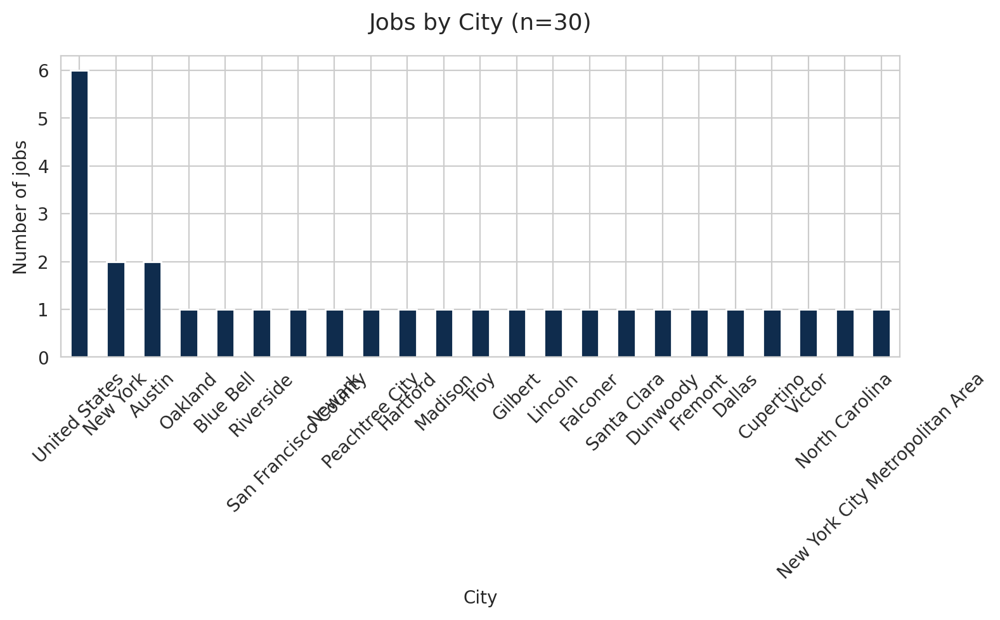
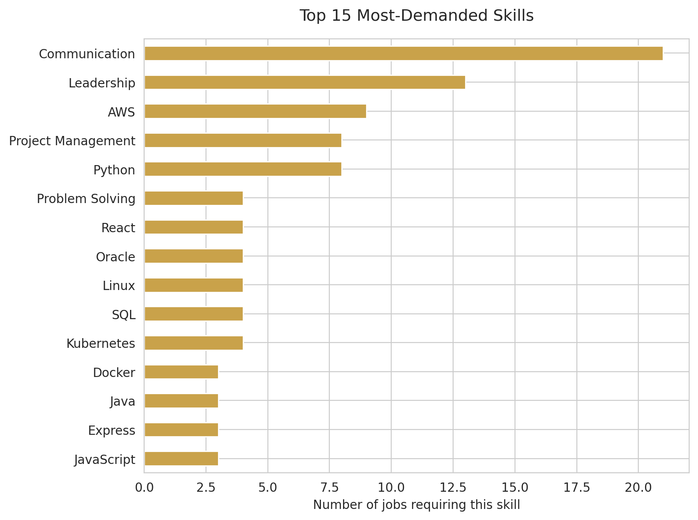
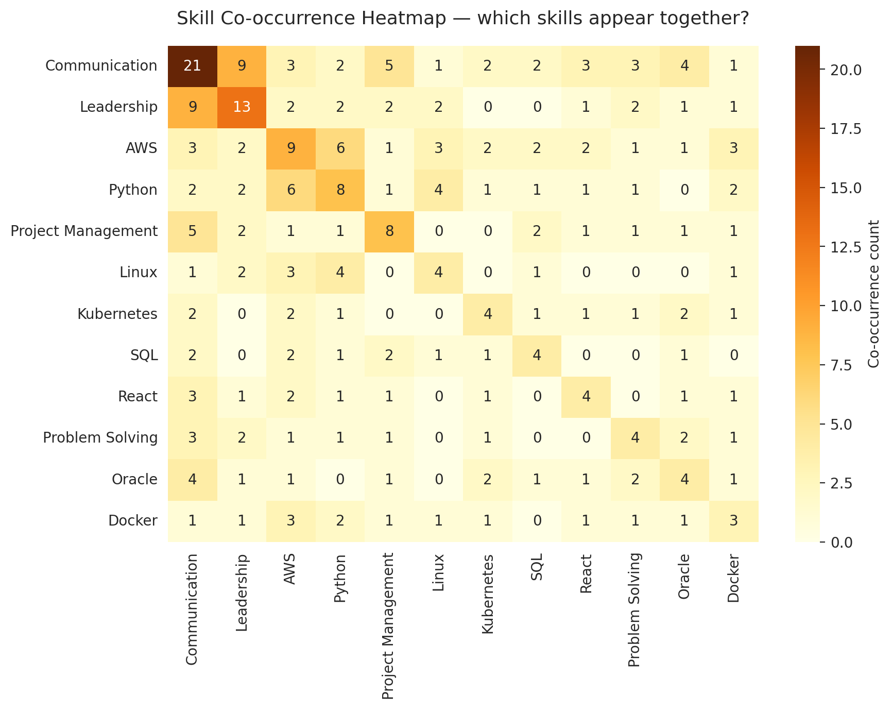
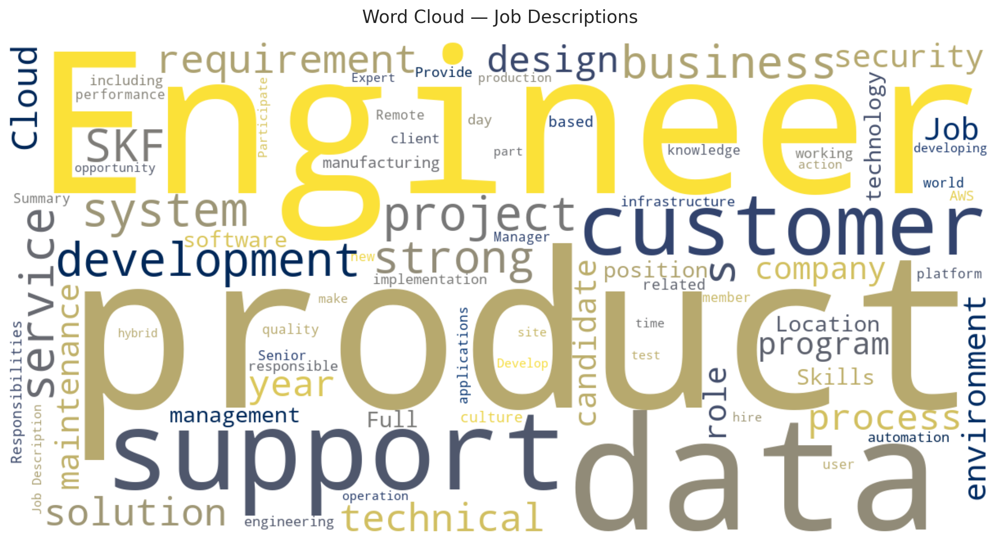

# Exploratory Data Analysis

## Dataset Overview
The CareerPilot AI matching engine operates over a curated dataset of 30
tech roles sourced from real LinkedIn job postings. Jobs span backend
engineering, frontend development, data analytics, machine learning,
DevOps, mobile development, and more. Each job has a title, company,
location, description, and a list of required skills extracted from the
posting text.

## Geographic Distribution

The dataset covers a diverse range of locations across the United States
and internationally, reflecting the global nature of tech hiring. Location
data is used in the matching engine's profile filtering.

## Skill Demand

The most-demanded skills in our dataset are Python, JavaScript, SQL, Git,
and AWS — broadly consistent with the global tech market. The prominence
of cloud skills (AWS, Kubernetes) reflects the industry's shift toward
cloud-native infrastructure.

## Skill Co-occurrence Patterns

Co-occurrence analysis reveals natural skill clusters in the dataset:
(1) Data/ML — Python, SQL, TensorFlow, Scikit-learn;
(2) Web full-stack — JavaScript, React, Node.js, Git;
(3) DevOps/Cloud — AWS, Docker, Linux, Kubernetes.
These clusters inform our matching engine: when a candidate matches one
skill from a cluster, the system tends to recommend jobs from that cluster.

## Vocabulary Patterns

The word cloud of job descriptions shows dominant themes around
"develop", "build", "system", and "data" — confirming the
software-engineering and data-science focus of the dataset. These
descriptive terms are weighted appropriately by our TF-IDF model
(which down-weights common words via IDF).

## Implications for the Matching Engine
The dataset's vocabulary diversity (4,483 unique tokens in our TF-IDF
model) is sufficient for meaningful cosine similarity computation. The
30-job sample covers all major skill clusters, ensuring the system can
recommend jobs across different tech roles rather than only one specialty.
