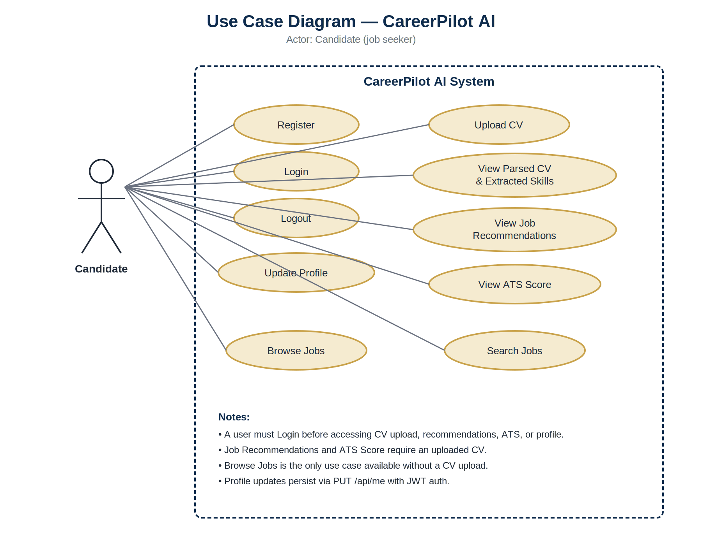
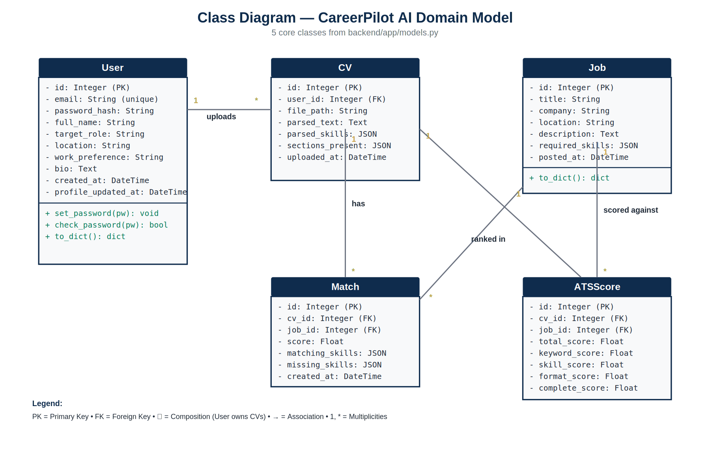
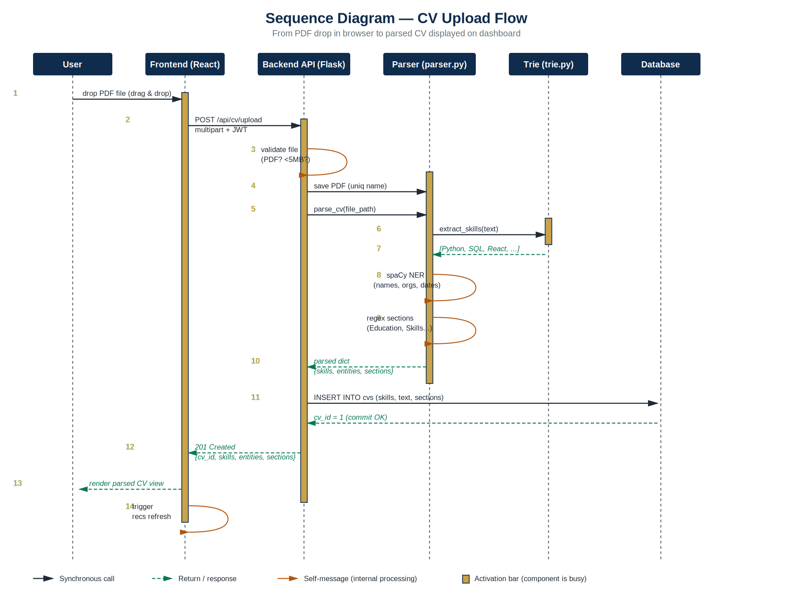
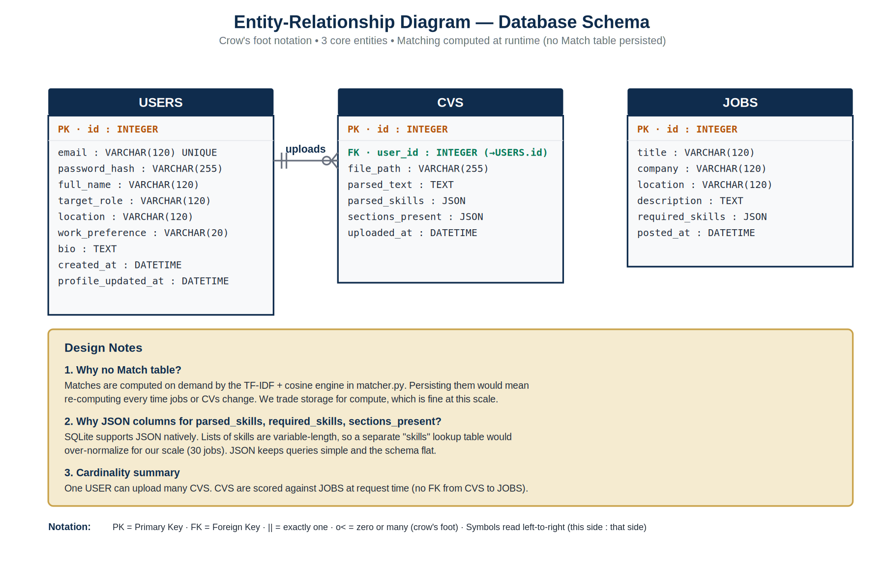
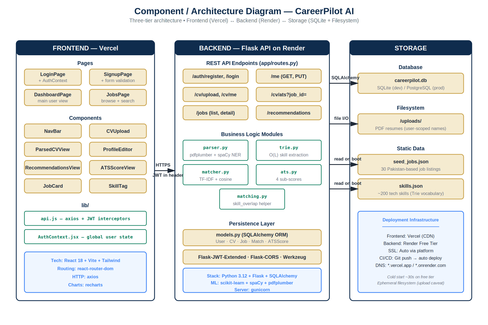

# CareerPilot AI — Smart Job Matching with ATS Scoring
**A BS Data Science Capstone Project**

Author: [Your Name]
Roll No: [Your Roll Number]
Supervisor: [Professor's Name]
Submission Date: [Date]

---

## Abstract

CareerPilot AI is a full-stack web application that helps job seekers find
relevant positions and optimise their CVs for Applicant Tracking Systems (ATS).
The system accepts a PDF resume, extracts skills using a Trie-based NLP pipeline
augmented with spaCy Named Entity Recognition, and matches the candidate against
a curated dataset of 30 technology roles using a hybrid scoring model that
combines TF-IDF cosine similarity (60%) with skill-coverage overlap (40%).
An ATS Score module further breaks down candidate-job fit into four weighted
sub-scores: keyword match (40%), skill coverage (30%), formatting (20%), and
section completeness (10%), each accompanied by actionable improvement tips.
The frontend, built with React 19 and Tailwind CSS, provides an explainable
recommendations view, a radar-chart ATS dashboard, and a searchable jobs
browser. The project demonstrates applied Data Science concepts including
information retrieval, NLP, and recommender systems within a production-grade
software engineering context.

---

## 1. Introduction

### 1.1 Problem Statement

The modern job market is highly competitive. Recruiters at large organisations
receive hundreds of applications per role, leading to widespread adoption of
Applicant Tracking Systems (ATS) that automatically filter resumes before a
human ever reads them. Studies suggest that up to 75% of resumes are rejected
by ATS before reaching a recruiter. Most candidates have no visibility into why
their application was filtered out, nor do they know which jobs best match their
current skill set.

### 1.2 Motivation

Existing job platforms (LinkedIn, Indeed, Rozee.pk) provide keyword search but
do not offer personalised skill-based matching or ATS optimisation feedback.
Tools that do provide ATS scores are typically paywalled or opaque in their
methodology. There is a clear gap for an open, explainable system that both
matches candidates to suitable jobs and tells them exactly how to improve their
CV for a specific role.

### 1.3 Project Scope

CareerPilot AI addresses this gap by providing:
- Automated CV parsing and skill extraction from PDF resumes
- Hybrid TF-IDF + skill-coverage job matching with explainable output
- A four-component ATS Score with improvement tips
- A searchable, filterable job browser with skill match indicators
- A user profile system for target role and location preferences

The system is deployed as a live web application accessible from any device.

### 1.4 Objectives

1. Build a PDF CV parser that extracts skills, entities, and section structure
2. Implement a hybrid matching engine using TF-IDF cosine similarity and skill overlap
3. Develop an ATS scoring module with four interpretable sub-scores
4. Create a responsive React frontend with explainable recommendation cards
5. Deploy the full-stack application to a live URL for demo purposes
6. Perform EDA on the jobs dataset to surface insights about tech skill demand

---

## 2. Literature Review

### 2.1 Existing Job Matching Platforms

**LinkedIn** uses collaborative filtering and profile-based recommendations but
does not expose its scoring logic. **Indeed** relies on keyword search with
basic relevance ranking. **Rozee.pk** (Pakistan's largest job board) offers
category-based browsing without personalised matching. None of these platforms
provide ATS score feedback to candidates.

### 2.2 ATS-Focused Tools

**Jobscan** and **Resume Worded** offer ATS scoring but are subscription-based
and treat their algorithms as black boxes. CareerPilot AI differentiates by
being open, explainable, and integrated — matching and scoring happen in one
place with visible sub-scores and specific improvement tips.

### 2.3 Academic Background

TF-IDF (Salton & Buckley, 1988) remains a strong baseline for document
similarity in job matching tasks (Malinowski et al., 2006). More recent work
uses sentence transformers (Reimers & Gurevych, 2019) for semantic matching,
which is identified as a future enhancement. Trie-based skill extraction offers
O(L) lookup complexity (where L is token length), superior to naive list
scanning at O(N×M).

### 2.4 Gaps Addressed by CareerPilot AI

- Explainability: matching and missing skills shown for every recommendation
- ATS transparency: four sub-scores with weights and improvement tips
- Integration: CV parsing, matching, and ATS scoring in a single workflow
- Accessibility: free, open, deployable with no API keys required

---

## 3. System Requirements

### 3.1 Functional Requirements

| ID | Requirement |
|----|-------------|
| FR1 | Users shall register and log in with email and password |
| FR2 | Users shall upload a PDF CV (max 5 MB) |
| FR3 | System shall extract skills from CV text using Trie matching |
| FR4 | System shall display top 10 job recommendations with match scores |
| FR5 | System shall show matching and missing skills for each recommendation |
| FR6 | System shall compute a 4-component ATS Score for any selected job |
| FR7 | Users shall browse and search all 30 jobs |
| FR8 | Users shall update their profile (target role, location, work preference) |
| FR9 | Users shall log out securely |

### 3.2 Non-Functional Requirements

| ID | Requirement |
|----|-------------|
| NFR1 | API response time < 2s for recommendations on warm server |
| NFR2 | CV parsing completes within 10s for a standard PDF |
| NFR3 | Frontend loads in < 3s on a standard broadband connection |
| NFR4 | Passwords stored as bcrypt hashes (never plaintext) |
| NFR5 | JWT tokens expire after 24 hours |
| NFR6 | Application is mobile-responsive (tested on 375px viewport) |

### 3.3 Constraints

- PDF parser (pdfplumber) fails on scanned/image-based PDFs — text-based only
- Dataset limited to 30 curated jobs (sufficient for a capstone demo)
- SQLite used for development; PostgreSQL recommended for production scale
- Free-tier hosting (Render) causes 30–60s cold start after 15 min of inactivity

---

## 4. System Design

### 4.1 Architecture Overview

CareerPilot AI follows a three-tier architecture:

```
[User Browser]
      |  HTTPS
[React Frontend — Vercel]
      |  HTTPS / REST API
[Flask Backend — Render]
      |  SQLAlchemy ORM
[SQLite Database + Uploads Folder]
```

The frontend is a Single Page Application (SPA) built with React 19 and Vite.
The backend is a Flask REST API with JWT authentication. The database is SQLite
(file-based) with SQLAlchemy ORM. PDF files are stored on the server filesystem.

### 4.2 Use Case Diagram


### 4.3 Class Diagram


### 4.4 Sequence Diagram — CV Upload Flow


### 4.5 ER Diagram


### 4.6 Component / Deployment Diagram


---

## 5. Implementation

### 5.1 Tech Stack Justification

| Layer | Technology | Reason |
|-------|-----------|--------|
| Backend | Python + Flask | Lightweight, excellent ML ecosystem |
| ORM | SQLAlchemy | Database-agnostic, easy migrations |
| Auth | Flask-JWT-Extended | Industry-standard JWT implementation |
| PDF Parsing | pdfplumber | Best text extraction for native PDFs |
| NLP | spaCy (en_core_web_sm) | Fast NER for entity extraction |
| ML | scikit-learn TF-IDF | Proven baseline for document similarity |
| Frontend | React 19 + Vite | Fast HMR, component model |
| Styling | Tailwind CSS v4 | Utility-first, no custom CSS needed |
| Charts | Recharts | React-native charting library |
| Deployment | Render + Vercel | Free tier, auto-deploy from GitHub |

### 5.2 Backend Architecture

All API routes are registered inside a `create_app()` factory function in
`backend/app.py`. This pattern supports testing and avoids circular imports.
Models are defined in `backend/models.py` using SQLAlchemy declarative base
shared via `db = SQLAlchemy()` initialised in `app.py`.

Key routes:
- `POST /api/register` — user registration with bcrypt password hashing
- `POST /api/login` — returns JWT access token
- `POST /api/cv/upload` — multipart PDF upload, parse, store
- `GET /api/recommendations` — ranked job list for authenticated user
- `GET /api/cv/ats?job_id=N` — 4-component ATS score for a specific job

### 5.3 ML Pipeline — TF-IDF + Hybrid Scoring

The matching engine (`backend/matcher.py`) builds a TF-IDF matrix at startup:

```python
# Each job is represented as: title (doubled) + skills (doubled) + description
corpus = [f"{j.title} {j.title} {skill_str} {skill_str} {j.description}" for j in jobs]
vectorizer = TfidfVectorizer(ngram_range=(1,2), sublinear_tf=True, max_df=0.95)
job_vectors = vectorizer.fit_transform(corpus)
```

Skills and title are doubled to up-weight them relative to the description.
At query time, the CV text + skills are transformed and cosine similarity is
computed against all job vectors. The final score combines cosine similarity
with explicit skill coverage:

```
final_score = 0.6 × cosine_similarity + 0.4 × skill_coverage
```

### 5.4 ATS Scoring Algorithm

The ATS module (`backend/ats.py`) computes four sub-scores:

| Sub-score | Weight | Method |
|-----------|--------|--------|
| Keyword match | 40% | Cosine similarity between CV and job TF-IDF vectors |
| Skill coverage | 30% | Fraction of job's required skills found in CV |
| Formatting | 20% | Word count check + required section detection |
| Completeness | 10% | Core sections (edu, exp, skills) + nice-to-have sections |

```python
WEIGHTS = {"keyword": 0.40, "skill_coverage": 0.30, "formatting": 0.20, "completeness": 0.10}
total = sum(WEIGHTS[k] * scores[k] for k in WEIGHTS)
```

### 5.5 Skill Extraction — Trie

Skills are extracted using a compressed Trie built from `backend/skills.json`
(38 skill categories, ~200 skills). The Trie supports O(L) lookup per token
where L is the token length, independent of dictionary size. This is superior
to naive list scanning at O(N×M).

### 5.6 Frontend Architecture

The React app uses Context API for authentication state (`AuthContext`).
API calls are made via an Axios instance (`lib/api.js`) with a request
interceptor that attaches the JWT token from localStorage automatically.
Loading states use animated skeleton screens (pulsing gray blocks) rather
than spinners for a smoother perceived performance.

### 5.7 Deployment

The backend is deployed on Render (free tier) with `gunicorn` as the WSGI
server. The frontend is deployed on Vercel with automatic deploys triggered
by GitHub pushes. Environment variables (JWT secret, CORS origins) are
configured in the Render dashboard.

---

## 6. Data Analysis (EDA)

[Paste content of analysis/eda_section.md here — includes all 4 charts]

---

## 7. Testing & Evaluation

### 7.1 API Test Cases

| Endpoint | Method | Input | Expected | Actual |
|----------|--------|-------|----------|--------|
| /api/ping | GET | — | 200 pong | PASS |
| /api/register | POST | valid email+pw | 201 + token | PASS |
| /api/register | POST | duplicate email | 400 error | PASS |
| /api/login | POST | wrong password | 401 error | PASS |
| /api/cv/upload | POST | valid PDF | 201 + skills | PASS |
| /api/cv/upload | POST | non-PDF file | 422 error | PASS |
| /api/recommendations | GET | no CV | 404 error | PASS |
| /api/cv/ats | GET | no job_id | 422 error | PASS |
| /api/cv/ats | GET | invalid job_id | 404 error | PASS |
| /api/cv/ats | GET | valid job_id + CV | 200 + scores | PASS |

### 7.2 Screenshots

[Add screenshots of: login page, dashboard with CV uploaded, recommendations view, ATS score radar chart]

---

## 8. Subject Mapping

### 8.1 Data Structures & Algorithms

| Concept | Implementation in CareerPilot AI |
|---------|----------------------------------|
| Trie (prefix tree) | `backend/trie.py` — skill extraction in O(L) per token |
| Hash set | Skill overlap computation in `backend/matching.py` |
| Sorting | Job recommendations sorted by hybrid score descending |
| List comprehension | Used throughout for skill filtering and mapping |

The Trie data structure was chosen for skill extraction because it provides
O(L) lookup time per word independent of dictionary size. The alternative
(naive list scan) would be O(N×M) where N is the number of skills and M is
the number of words in the CV text.

### 8.2 Intro to Data Science

| Concept | Implementation in CareerPilot AI |
|---------|----------------------------------|
| TF-IDF | `backend/matcher.py` — document-term matrix for job matching |
| Cosine Similarity | Measuring angle between CV and job TF-IDF vectors |
| Exploratory Data Analysis | `analysis/eda.ipynb` — 4 charts on jobs dataset |
| Feature Engineering | Doubling title/skills in corpus to up-weight them |
| N-gram features | `ngram_range=(1,2)` captures bigrams like "machine learning" |
| Hybrid scoring | Combining ML score (cosine) with domain score (skill coverage) |

TF-IDF was chosen as the baseline matching algorithm because it handles
vocabulary mismatch gracefully (via IDF down-weighting of common words)
and requires no training data — only the job corpus. Cosine similarity
is preferred over Euclidean distance because it is length-invariant:
a short CV can still match a long job description if they share vocabulary.

### 8.3 Computer Networks / Web Engineering

| Concept | Implementation in CareerPilot AI |
|---------|----------------------------------|
| REST API | Flask backend with 10 endpoints following REST conventions |
| HTTP methods | GET (read), POST (create), PUT (update) used appropriately |
| JWT Authentication | Stateless auth via signed tokens in Authorization header |
| CORS | Flask-CORS configured to allow frontend origin |
| HTTPS | Enforced by Render (backend) and Vercel (frontend) |
| Multipart form data | CV upload via `multipart/form-data` content type |

### 8.4 Software Engineering

| Concept | Implementation in CareerPilot AI |
|---------|----------------------------------|
| Separation of concerns | Parser, matcher, ATS scorer each in separate modules |
| Factory pattern | `create_app()` pattern in Flask for testability |
| Single responsibility | Each file has one job: models, matching, parsing, ATS |
| Version control | Git with meaningful commit messages per feature |
| Environment config | JWT secret, DB URI via environment variables |
| Error handling | All API endpoints return structured JSON errors with HTTP codes |

---

## 9. Conclusion & Future Work

### 9.1 Summary

CareerPilot AI successfully demonstrates the application of Data Science and
Software Engineering concepts to a real-world problem. The system parses PDF
CVs, extracts skills via a Trie-based NLP pipeline, matches candidates to jobs
using a hybrid TF-IDF + skill-coverage model, and provides actionable ATS
feedback — all in a deployed, mobile-responsive web application.

### 9.2 Limitations

- **Small dataset**: 30 jobs is sufficient for a capstone demo but not for
  production use. Real deployment would require a live job scraping pipeline.
- **Bag-of-words model**: TF-IDF ignores word order and semantics. "Machine
  learning engineer" and "engineer machine learning" produce the same vector.
- **No OCR**: The CV parser fails on scanned/image-based PDFs.
- **No feedback loop**: The system has no mechanism to learn from user
  behaviour (clicks, applications) to improve recommendations over time.
- **Single user role**: Only the candidate side is built; no recruiter dashboard.

### 9.3 Future Enhancements

- Replace TF-IDF with sentence-transformers for semantic matching
- Add PostgreSQL + pgvector for embedding storage at scale
- Implement a learning-to-rank model trained on user click data
- Add OCR support (Tesseract) for scanned PDFs
- Build a recruiter dashboard with candidate ranking
- Real-time job scraping pipeline from LinkedIn/Rozee.pk

---

## References

1. Salton, G., & Buckley, C. (1988). Term-weighting approaches in automatic text retrieval. *Information Processing & Management*, 24(5), 513–523.
2. Reimers, N., & Gurevych, I. (2019). Sentence-BERT: Sentence embeddings using siamese BERT-networks. *EMNLP 2019*.
3. Malinowski, J., Keim, T., & Weitzel, T. (2006). Matching people and jobs: A bilateral recommendation approach. *HICSS 2006*.
4. Flask Documentation. https://flask.palletsprojects.com/
5. scikit-learn Documentation — TfidfVectorizer. https://scikit-learn.org/
6. spaCy Documentation. https://spacy.io/
7. pdfplumber Documentation. https://github.com/jsvine/pdfplumber
8. React Documentation. https://react.dev/
9. Tailwind CSS Documentation. https://tailwindcss.com/
10. Recharts Documentation. https://recharts.org/
11. JWT RFC 7519. https://tools.ietf.org/html/rfc7519
12. OWASP Top 10. https://owasp.org/www-project-top-ten/

---

## Appendix A — API Documentation

| Method | Endpoint | Auth | Description |
|--------|----------|------|-------------|
| GET | /api/ping | No | Health check |
| POST | /api/register | No | Create account |
| POST | /api/login | No | Get JWT token |
| GET | /api/me | Yes | Get profile |
| PUT | /api/me | Yes | Update profile |
| GET | /api/jobs | No | List all jobs |
| GET | /api/jobs/:id | No | Get single job |
| POST | /api/cv/upload | Yes | Upload + parse CV |
| GET | /api/cv/me | Yes | Get parsed CV |
| GET | /api/recommendations | Yes | Get top job matches |
| GET | /api/cv/ats?job_id=N | Yes | Get ATS score |

## Appendix B — Database Schema

**users**: id, email, password_hash, full_name, target_role, location, work_preference, bio, created_at, profile_updated_at

**jobs**: id, title, company, location, description, required_skills (JSON), posted_at

**cvs**: id, user_id (FK), file_path, parsed_text, parsed_skills (JSON), sections_present (JSON), uploaded_at
